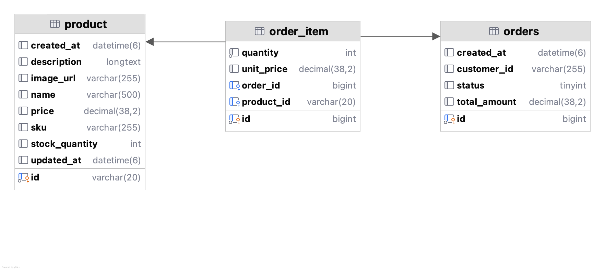
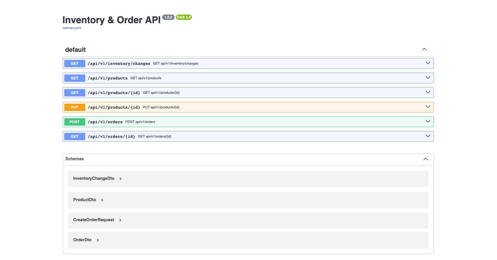
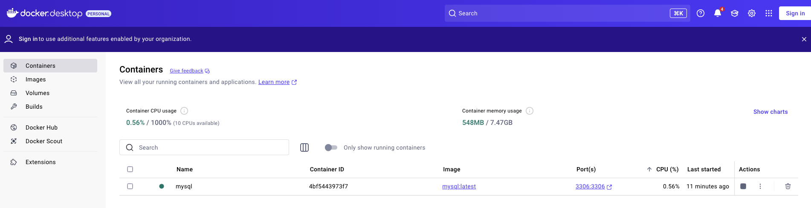
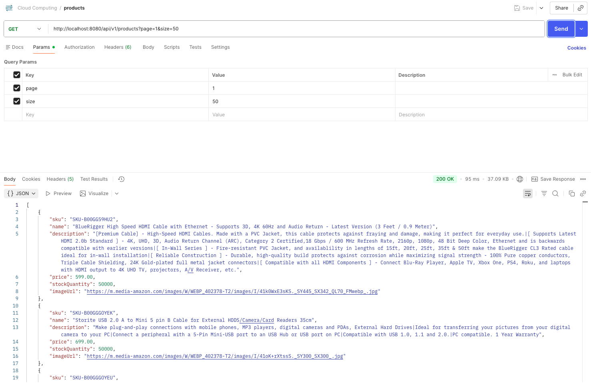
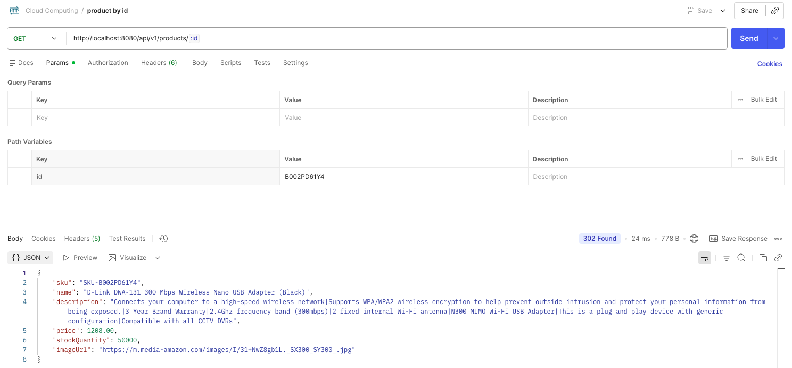
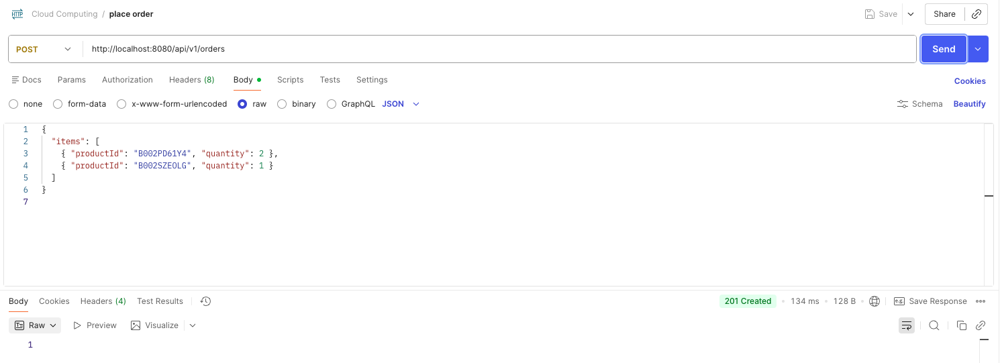
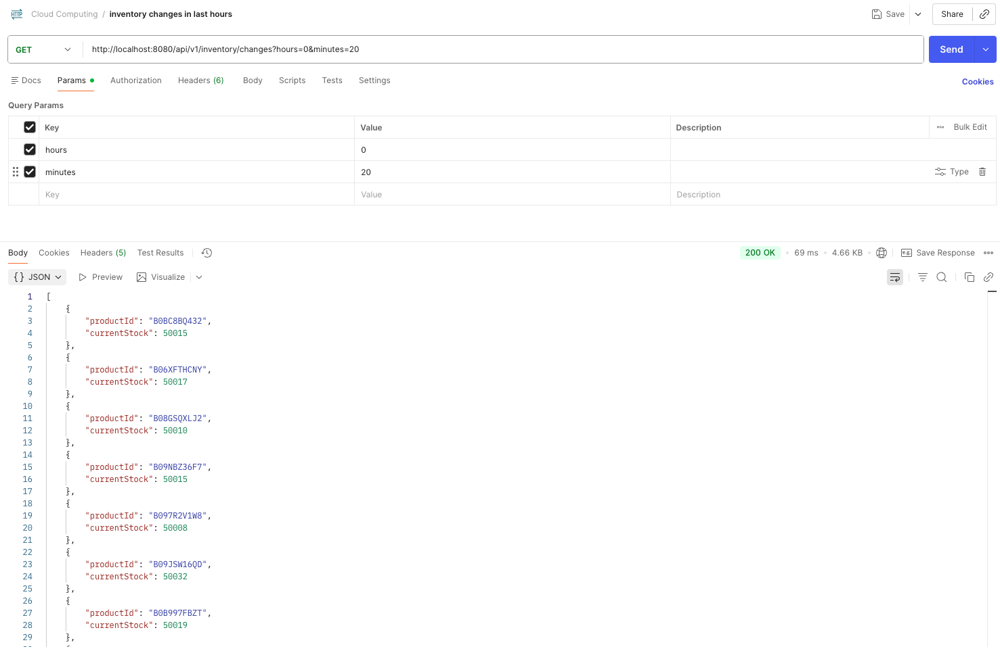

# Final Project for Cloud Computing course 2024/2025
- Student: Viktoriia Vlasenko
- Matricola: 2088928
- Email: vlasenko.2088928@studenti.uniroma1.it
## Objective
***Project Option 5***

> To deploy a scalable and high-available multitier web application that foreseen a data layer (a Database or an object store area). You must deploy your web application in at least two availability zones and configure a step scaling autoscaling policy with at least two rules to scale out and two rules to scale in (It is not allowed to use the target tracking autoscaling policy). Evaluate the performance and scalability of your deployment under different workload conditions.

## Application Architecture
"Inventory" is a web application for placing the customer orders and inventoring the residual products after purchasing them.

In the course objectives it is implemented in terms to have Application and Data Level. In the following sections there are specified REST API documentation, Entity Relationships between Products and Orders.

As an evolutive of the application architecture it is possible to enrich it with greater functionality as:
- user sign-up and sign-in;
- user account with lists of orders (delivered and in the shopping cart);
- role-based access to the different REST APIs.

### Data Layer
- *Type*: MySQL

Data structure of the Multier Application "Inventory" is based on the existing Amazon dataset [https://www.kaggle.com/datasets/karkavelrajaj/amazon-sales-dataset](https://www.kaggle.com/datasets/karkavelrajaj/amazon-sales-dataset) with features relevant for the project:
|Feature|Description|
|---|---|
|product_id|Product ID|
|product_name|Name of the Product|
|actual_price|Actual Price of the Product|
|about_product|Description about the Product|
|img_link|Image Link of the Product|

Its cleaned version for initial database enrichment is placed in this file [products-clean.csv](./dataset/products-clean.csv). 

For cleaning and writing the data to the database it was used the following Jupyter Notebook [amazon-sales.ipynb](./notebooks/amazon-sales.ipynb), that contains primitive EDA (exploratory data analysis) and implementation of MySQL connector.

The resulting Entity Relationship Diagram is as follows:


*Diagram 2 - ER diagram of Data Layer*

### Web Application Specification
- *Language*: Java
- *Technical stack*: Spring Framework


#### API Documentation

|Type|Entity| Endpoint|Purpose and Description|
|---|---|---|---|
|GET|Product|`/api/v1/products`|Get paginated products|
|GET|Product|`/api/v1/products/{id}`|Get product by its id|
|POST|Order|`/api/v1/orders`|Place order: * Validate stock * Decrease stock atomically * Create order + order items|
|Get|Inventory Abstruction|`/api/v1/inventory/changes`|Check all the recent changes|

API documentation is published using Github Pages and accessible by the following link: [https://vikavl.github.io/E-Commerce-Inventory/](https://vikavl.github.io/E-Commerce-Inventory/)


*Image 1 - Swagger Preview*

#### Demostration with Docker and Postman

For demonstration I created a local MySQL container in Docker Desktop and run my Spring Boot web application:



Using Postman I verified responsivness of my local server endpoints.

`GET /api/v1/products`

```r
curl --location 'http://localhost:8080/api/v1/products?page=1&size=50'
```


`GET /api/v1/products/{id}`

```r
curl --location 'http://localhost:8080/api/v1/products/B002PD61Y4'
```



`PUT /api/v1/orders`

```r
curl --location 'http://localhost:8080/api/v1/orders' \
--header 'Content-Type: application/json' \
--data '{
  "items": [
    { "productId": "B002PD61Y4", "quantity": 2 },
    { "productId": "B002SZEOLG", "quantity": 1 }
    ]
}'
```


`GET /api/v1/inventory/changes`

```r
curl --location 'http://localhost:8080/api/v1/inventory/changes?hours=0&minutes=20'
```


### Load Generator

?????? Crutial part

## Tecnical Architecture

*Diagram 3 - C4 Model* 


*Diagram 4 - AWS Infrustructure* 

### 1. AWS Components: Networking 

### 1. AWS Components: Internet Gateway (IGW) 
### 1. AWS Components: S3 Integration 
### 1. AWS Components: Database (Amazon RDS - MySQL)
### 1. AWS Components: Application Layer (EC2) 

