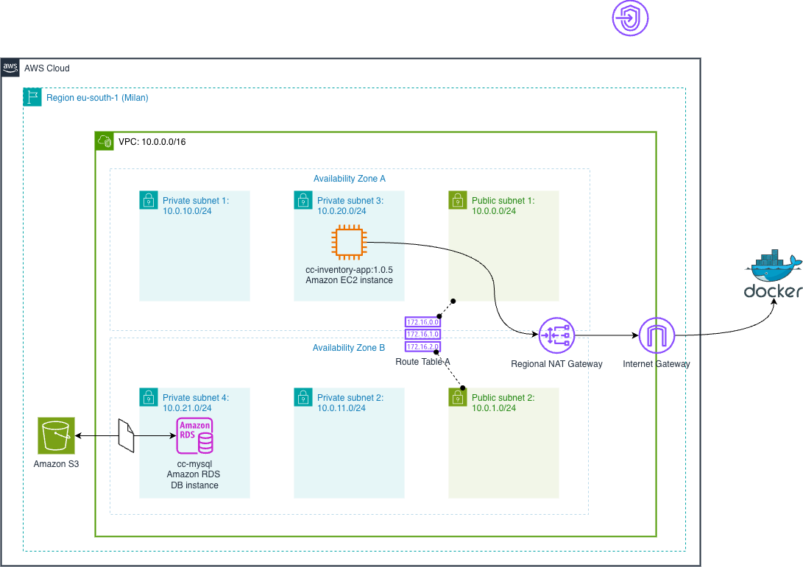

# Final Project for Cloud Compiting course 2024/2025
## Objective
***Project Option 5***

To deploy a scalable and high-available multitier web application that foreseen a data
layer (a Database or an object store area). You must deploy your web application in at
least two availability zones and configure a step scaling autoscaling policy with at least
two rules to scale out and two rules to scale in (It is not allowed to use the target tracking
autoscaling policy). Evaluate the performance and scalability of your deployment under
different workload conditions

## Application Architecture

### Web Application Specification

#### API Documentation
Interactive API Docs: [https://vikavl.github.io/E-Commerce-Inventory/](https://vikavl.github.io/E-Commerce-Inventory/)

### Data Layer

*Diagram 1 - ER diagram of Data Layer*

### Load Generator

## Tecnical Architecture

*Diagram 2 - C4 Model* 

*Diagram 3 - AWS Infrustructure* 

### 1. AWS Components: Networking 

### 1. AWS Components: Internet Gateway (IGW) 
### 1. AWS Components: S3 Integration 
### 1. AWS Components: Database (Amazon RDS - MySQL)
### 1. AWS Components: Application Layer (EC2) 

